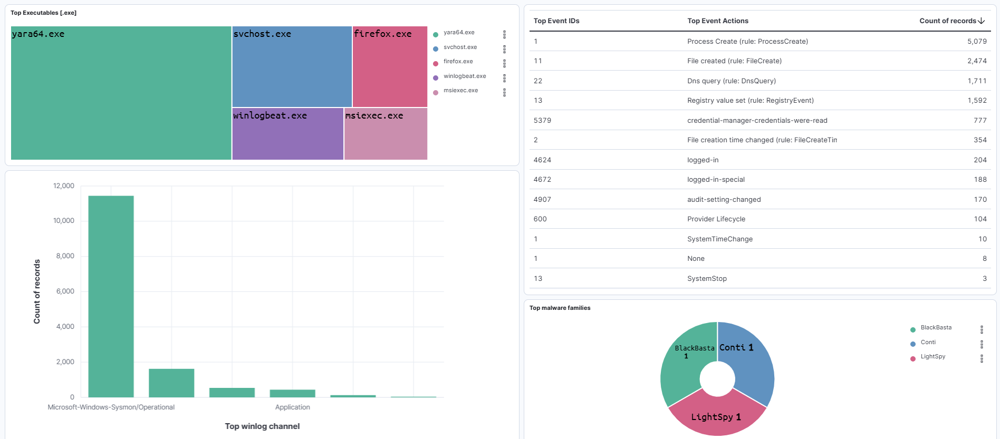
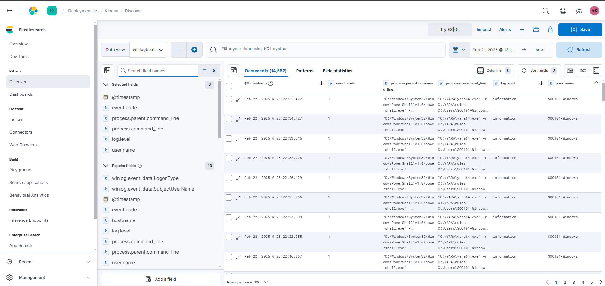

# Threat Detection with ELK, Sysmon, YARA & AlienVault OTX  

 **Designed and configured a threat hunting environment utilizing [ELK Stack](https://www.elastic.co/what-is/elk-stack), [Sysmon](https://docs.microsoft.com/en-us/sysinternals/downloads/sysmon), and [YARA](https://virustotal.github.io/yara/) to strengthen log analysis and security monitoring.**  

---
## ELK Dashboard Overview  
  

## Sysmon Analysis

## Winlogbeat Logs

##  OTX Threat Intelligence

---

## Tools & Techniques  
- **[ELK Stack](https://www.elastic.co/what-is/elk-stack) Enterprise Cloud** – 14-day free trial setup for security log analysis  
- **[Sysmon](https://docs.microsoft.com/en-us/sysinternals/downloads/sysmon)** – Advanced endpoint logging for deep visibility  
- **[Winlogbeat](https://www.elastic.co/beats/winlogbeat)** – Windows log collection & forwarding to Elastic  
- **[AlienVault OTX](https://otx.alienvault.com/)** – Integrated threat intelligence feeds via Python  
- **[YARA](https://virustotal.github.io/yara/)** – Malware detection using **Florin Roug's** GitHub signatures  

---

## Platforms & Environment  
- **[Elastic Cloud](https://cloud.elastic.co/)** for centralized security analytics  
- **Windows** as the monitored endpoint  
- **Python scripting** for **OTX integration**  

---

 **This project helped in identifying potential threats, logging suspicious activity, and automating detection using powerful security tools!**  

---
 Follow for more updates and insights:

- **[LinkedIn](https://www.linkedin.com/in/raajeshmenghwar)**
- **[Medium](https://raajeshmenghwar.medium.com)**

**Keep hacking and stay curious!**
